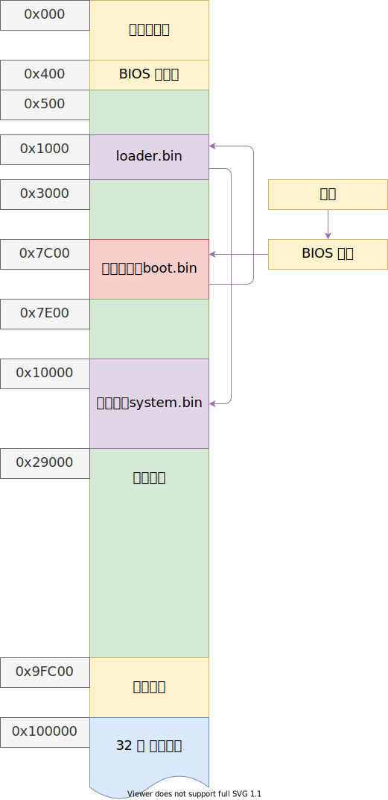

# 039 内存管理初步

本节实现从 loader 的内存检测结果获取可用内存区域，并在内核空间记录相关的内存信息，操作形式尽可能兼容 **GRUB MultiBoot**。

## 1. 原理说明

有些相关的原理说明位于 [<008 内存检测>](../01_bootloader/008_detect_memort.md) 处，例如 `ARDS` 结构体。

以下是目前的内存分布图：



- 386/486 内存分页是以 4K = 4096B = 0x1000B 为单位；
- 奔腾处理器引入了以 4M 为单位的页；

本节的主要目的就是检测从 `0x100000` 地址开始的 32 位可用区域，并进行记录，以方便后面的内存分配实现。

## 2. 代码分析

### 2.1 内核魔数

在 `include/xos/xos.h` 中将内核魔数改为 16 进制。

```c
#define XOS_MAGIC 0x20230614 // 内核魔数
```

在内核加载器（位于 `boot/laoder.asm`）中，仿照 BIOS 检测主引导扇区魔数的逻辑，将内核魔数及地址描述符的起始地址，分别保存到寄存器 `eax` 和 `ebx` 中。

```x86asm
protected_mode:
    ...
    mov eax, 0x20230614  ; 内核魔数
    mov ebx, ards_cnt    ; 地址描述符地址
    ...
```

在内核入口处（位于 `kernel/start.asm`）中，将之前内核加载器 `loader` 在寄存器 `eax` 和 `ebx` 中保存的魔数及地址，保存至指定的数据区中。

```x86asm
_start:
    mov [kernel_magic], eax ; magic
    mov [ards_addr], ebx ; ards_count

    call kernel_init

    jmp $ ; 阻塞


section .data
; 内核魔数
global kernel_magic
kernel_magic:
    dd 0
; 地址描述符地址
global ards_addr
ards_addr:
    dd 0
```

>通过寄存器将 `loader` 中的魔数值传递给内核，是为了和 **GRUB MultiBoot** 兼容。

至此，已经实现了对内核魔数及地址描述符起始地址的保存（这些数据在后面的 `memory_init` 会用到）。

---

同时，将之前内核加载器 `loader` 中关于 `ards_cnt` 由 16 位宽改为 32 位宽记录，方便在内核中处理。

```x86asm
detect_memory:
    ...
.next:
    ...
    inc dword [ards_cnt] ; 更新记录的 ards 结构体数量
    ...

ards_cnt:
    dd 0
```

### 2.2 内存相关定义

定义一些内存相关的常量，结构体和功能。例如一页大小，空闲内存起始地址，获取页索引，地址描述符。这些定义位于 `include/xos/memory.h` 及 `kernel/memory.c` 处。

```c
#define PAGE_SIZE   0x1000 // 页大小为 4K
#define MEMORY_ALLOC_BASE 0x100000 // 32 位可用内存起始地址为 1M

// 获取 addr 的页索引
#define PAGE_IDX(addr) ((u32)addr >> 12) 

#define ZONE_VALID    1 // ards 可用内存区域
#define ZONE_RESERVED 2 // ards 不可用内存区域

// 地址描述符
typedef struct ards_t {
    u64 base; // 内存基址
    u64 size; // 内存大小
    u32 type; // 内存类型
} ards_t;
```

### 2.3 内存管理器

内存管理器，记录内存相关的信息，以提供给内核使用。（定义位于 `kernel/memory.c`）

```c
// 内存管理器
typedef struct memory_manager_t {
    u32 alloc_base;  // 可用内存基址（应该等于 1M）
    u32 alloc_size;  // 可用内存大小
    u32 free_pages;  // 可用内存页数
    u32 total_pages; // 所有内存页数
} memory_manager_t;

static memory_manager_t mm;
```

### 2.4 内存初始化

遍历内核加载器 `loader` 记录的所有地址描述符，并记录相关信息到内存管理器中。

```c
extern u32 kernel_magic;
extern u32 ards_addr;
void memory_init() {
    u32 cnt;
    ards_t *ptr;

    // 如果是 onix loader 进入的内核
    if (kernel_magic == XOS_MAGIC) {
        cnt = *(u32 *)ards_addr;
        ptr = (ards_t *)(ards_addr + 4);

        for (size_t i = 0; i < cnt; i++, ptr++) {
            LOGK("ZONE %d:[base]0x%p,[size]:0x%p,[type]:%d\n",
                 i, (u32)ptr->base, (u32)ptr->size, (u32)ptr->type);
            
            if (ptr->type == ZONE_VALID 
                && ptr->base >= MEMORY_ALLOC_BASE 
                && ptr->size > mm.alloc_size) {
                mm.alloc_base = ptr->base;
                mm.alloc_size = ptr->size;
            }
        }
    } else {
        panic("Memory init magic unknown 0x%p\n", kernel_magic);
    }

    mm.free_pages = PAGE_IDX(mm.alloc_size);
    mm.total_pages = mm.free_pages + PAGE_IDX(mm.alloc_base);

    // 判定内存地址的正确性
    assert(mm.alloc_base == MEMORY_ALLOC_BASE); // 可用内存起始地址为 1M
    assert((mm.alloc_base & 0xfff) == 0); // 可用内存按页对齐

    // 打印一些内存信息
    LOGK("ARDS count: %d\n", cnt);
    LOGK("Free memory base: 0x%p\n", (u32)mm.alloc_base);
    LOGK("Free memory size: 0x%p\n", (u32)mm.alloc_size);
    LOGK("Total pages: %d\n", mm.total_pages);
    LOGK("Free  pages: %d\n", mm.free_pages);
}
```

这里面使用了 2 条 `extern` 语句，这是为了引用之前在内核入口 `kernel/start.asm` 中保存的 `kernel_magic` 和 `ards_addr`。

这里面使用到了一个技巧，即 `PAGE_IDX()` 既可以用来计算页索引（通过地址），也可以通过内存空间大小来计算该内存空间包括多少页。

## 3. 功能测试

在内核主函数 `kernel/main.c` 中，对内存初始化 `memory_init()` 进行测试。

```c
void kernel_init() {
    console_init();
    gdt_init();
    memory_init();

    hang();
    return;
}
```

预期为，打印出一些相关的内存信息。这些信息大部分记录在内存管理器 `mm` 中，可以通过调试进行观察。

## 4. 参考文献

- <https://www.gnu.org/software/grub/manual/multiboot2/multiboot.html>
- <https://en.wikipedia.org/wiki/Memory_management_unit>