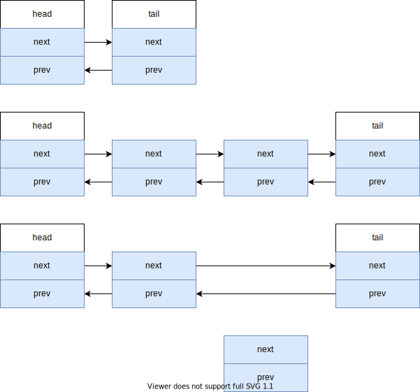

# 49 数据结构 - 链表

本节实现一个重要的数据结构：双向链表。

为了使链表的插入 / 删除的实现简单化，本节设计的链表有 **头节点** 和 **尾节点** 两个 **“虚节点”**。链表的示意图如下，从上往下分别为：空链表，非空链表，从链表插入 / 删除节点。



---

> **由于我们希望链表节点的数据区可以存放泛型数据，所以我们并不在节点中分配数据区，而是由以下两个宏来实现存/取泛型数据。这两个宏的实现细节留至后续解释。**

```c
#define element_offset(type, member) (u32)(&(type *)0->member)
#define element_entry(type, member, ptr) (type *)((u32)ptr - element_offset(type, member))
```

## 1. 数据结构

> 以下代码位于 `include/xos/list.h`

链表节点的结构：

```c
typedef struct list_node_t {
    struct list_node_t *prev; // 前驱节点
    struct list_node_t *next; // 后继节点
} list_node_t;
```

链表的结构：

```c
typedef struct list_t {
    list_node_t head; // 头节点
    list_node_t tail; // 尾节点
} list_t;
```

链表的方法：

```c
// 初始化链表
void list_init(list_t *list);

// 在 anchor 节点前插入节点 node
void list_insert_before(list_node_t *anchor, list_node_t *node);

// 在 anchor 节点后插入节点 node
void list_insert_after(list_node_t *anchor, list_node_t *node);

// 在链表中删除节点 node
void list_remove(list_node_t *node);

// 插入到头节点后
void list_push_front(list_t *list, list_node_t *node);

// 删除头节点后的节点
list_node_t *list_pop_front(list_t *list);

// 插入到尾节点前
void list_push_back(list_t *list, list_node_t *node);

// 删除尾节点前的节点
list_node_t *list_pop_back(list_t *list);

// 链表的长度
size_t list_size(list_t *list);

// 查找链表中是否存在节点 node
bool list_contains(list_t *list, list_node_t *node);

// 判断链表是否为空
bool list_empty(list_t *list);
```

## 2. 初始化链表

> 以下代码位于 `lib/list.c`

根据原理示意图，初始化链表时，分别设置头节点和尾节点，使得链表后续的插入 / 删除操作可以正确执行。

```c
// 初始化链表
void list_init(list_t *list) {
    list->head.prev = NULL;
    list->head.next = &list->tail;
    list->tail.prev = &list->head;
    list->tail.next = NULL;
}
```

## 3. 插入 / 删除

由于链表有头尾两个”虚节点“，所以实现节点的插入十分简单。

```c
// 在 anchor 节点前插入节点 node
void list_insert_before(list_node_t *anchor, list_node_t *node) {
    node->prev = anchor->prev;
    node->next = anchor;

    anchor->prev->next = node;
    anchor->prev = node;
}

// 在 anchor 节点后插入节点 node
void list_insert_after(list_node_t *anchor, list_node_t *node) {
    node->prev = anchor;
    node->next = anchor->next;

    anchor->next->prev = node;
    anchor->next = node;
}
```

对于节点的删除，首先需要保证被删除节点一定位于某一链表中，然后再按照原理删除即可。需要额外注意的是，不位于任意链表中的节点，它的 `prev` 和 `next` 域均为 `NULL`。

```c
// 在链表中删除节点 node
void list_remove(list_node_t *node) {
    assert(node->prev != NULL);
    assert(node->next != NULL);

    node->prev->next = node->next;
    node->next->prev = node->prev;

    node->prev = NULL;
    node->next = NULL;
}
```

## 4. push & pop

实现类似双端队列的头尾 `push` 和 `pop` 方法。这些方法是插入 / 删除的特殊情况，所以可以通过之前实现的插入 / 删除来实现。

与插入不同，`push` 方法必须保证不插入相同节点。而 `pop` 方法必须在保证链表非空的情况下，才能使用，`pop` 方法还会返回指向被删除节点的指针。

```c
// 插入到头节点后
void list_push_front(list_t *list, list_node_t *node) {
    assert(!list_contains(list, node));
    list_insert_after(&list->head, node);
}

// 删除头节点后的节点
list_node_t *list_pop_front(list_t *list) {
    assert(!list_empty(list));

    list_node_t *node = list->head.next;
    list_remove(node);

    return node;
}

// 插入到尾节点前
void list_push_back(list_t *list, list_node_t *node) {
    assert(!list_contains(list, node));
    list_insert_before(&list->tail, node);
}

// 删除尾节点前的节点
list_node_t *list_pop_back(list_t *list) {
    assert(!list_empty(list));

    list_node_t *node = list->tail.prev;
    list_remove(node);

    return node;
}
```

## 5. 其它方法

- `list_size()` 和 `list_contains()` 都是通过遍历链表的方式来实现的，时间复杂度为 $O(n)$。
- `list_empty()` 则是通过判断当前链表状态，是否符合链表初始化时的状态，来判断链表是否为空（初始化链表的作用是将链表构造成空链表的结构）。

```c
// 链表的长度
size_t list_size(list_t *list) {
    size_t size = 0;
    list_node_t *next = list->head.next;
    while (next != &list->tail) {
        size++;
        next = next->next;
    }
    return size;
}

// 查找链表中是否存在节点 node
bool list_contains(list_t *list, list_node_t *node) {
    list_node_t *next = list->head.next;
    while (next != &list->tail) {
        if (next == node) {
            return true;
        }
        next = next->next;
    }
    return false;
}

// 判断链表是否为空
bool list_empty(list_t *list) {
    return (list->head.next == &list->tail && list->tail.prev == &list->head);
}
```

宏 `ASSERT_NODE_FREE` 用于判断节点，当前是否处于任一链表当中。

```c
// 节点没有位于任一链表中
#define ASSERT_NODE_FREE(node) assert(((node)->prev == NULL) && ((node)->next == NULL))
```

## 6. 功能测试

在 `kernel/main.c` 搭建测试框架：

```c
void kernel_init() {
    ...
    list_test();

    hang();
    return;
}
```

在 `lib/list.c` 处实现测试函数（由于目前只有 `kalloc_page()` 和 `kfree_page()` 具备在虚拟内存空间中，分配和释放内存的能力，所以我们引入 `memory.h` 来使用）：

```c
/***** 测试链表 *****/
#include <xos/memory.h>
#include <xos/debug.h>

void list_test() {
    list_t holder;
    list_t *list = &holder;
    list_init(list);

    list_node_t *node;
    size_t count;

    count = 3;
    while (count--) {
        node = (list_node_t *)kalloc_page(1);        // should be 0x105000, 0x106000, 0x107000
        list_push_front(list, node);
    }
    LOGK("list size: %d\n", list_size(list));   // should be 3
    while (!list_empty(list)) {
        node = list_pop_front(list);            // should be 0x107000, 0x106000, 0x105000
        kfree_page((u32)node, 1);
    }
    LOGK("list size: %d\n", list_size(list));   // should be 0

    count = 3;
    while (count--) {
        node = (list_node_t *)kalloc_page(1);        // should be 0x105000, 0x106000, 0x107000
        list_push_back(list, node);
    }
    LOGK("list size: %d\n", list_size(list));   // should be 3
    while (!list_empty(list)) {
        node = list_pop_back(list);             // should be 0x107000, 0x106000, 0x105000
        kfree_page((u32)node, 1);
    }
    LOGK("list size: %d\n", list_size(list));   // should be 0

    node = (list_node_t *)kalloc_page(1);            // should be 0x105000
    list_push_back(list, node);

    LOGK("contains node 0x%p --> %d\n", node, list_contains(list, node));   // should be 1
    LOGK("contains node 0x%p --> %d\n", NULL, list_contains(list, NULL));   // should be 0

    list_remove(node);
    kfree_page((u32)node, 1);                        // should be 0x105000
}
```

使用调试来跟踪每一功能的执行，与注释所给的预期进行对比，如果与预期不符，则寻找修复 BUG。除此之外，在过程中观察链表结构，也是一个快速定位 BUG 的方法。

> 分配的地址从 0x105000 开始，这是因为在之前的 `task_init()` 已经分配了 3 页内存去作为 PCB 了，再加上可分配内存是从地址 0x102000 开始的。

## 7. 泛型数据

现在对之前两个神秘的宏 `element_offset` 和 `element_entry` 进行解释说明：

```c
#define element_offset(type, member) (u32)(&(type *)0->member)
#define element_entry(type, member, ptr) (type *)((u32)ptr - element_offset(type, member))
```

**这两个宏的作用是，通过结构体的某个成员的指针 / 地址，获取这个结构体的指针 / 地址。**

`element_offset` 中 `&(type *)0->member` 为获得成员 `member` 在结构体 `type` 中的偏移值。为什么获得的是偏移值，而不是地址，这是因为使用 `(type *)0` 这个巧妙的技巧，示意图如下：


`element_entry` 则通过某一结构体（暂且称之为 T）中某一成员 `member` 的指针 `ptr`，并计算成员 `member` 在结构体 `type` 中的偏移，通过 `ptr` 减去偏移，即可得到 `ptr` 所指向的成员 `member` 所在的结构体 T 的起始地址，也就是获得了该结构体 T 的指针。

所以，我们可以了使用这种思想来实现链表的泛型数据，将起链接作用的 `node` 作为上面所述结构体的成员 `member`。这样我们就可以通过 `node` 的指针 / 地址，来获取链表中该 `node` 所对应的结构体的指针。以 PCB 为例，以示意图如下：


