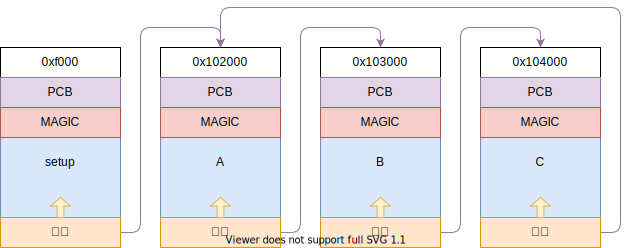

# 046 创建内核线程

本节内容是以 [<028 任务上下文>][028_task_context] 和 [<034 中断上下文>][034_interrupt_context] 为基础展开的，请自行查阅。

## 1. 进程控制块

将任务控制块 PCB 或者 任务控制块 TCB，扩展为如下结构：


## 2. 内核线程调度

本节的调度顺序如下图所示，其中 `setup` 线程为从开机至今的内核线程，其设置的栈顶初始位置为 0x10000（可查阅 `bootloader/loader`）。



## 3. 任务队列

本项目设计的任务队列 或者说 进程队列，如下图所示：


## 4. ROP

ROP - Return Oreiented Programming 面向返回编程

- `ret` 函数返回
- `iret` 中断结束返回到用户态

可通过调试跟踪 `task_switch` 以及 `interrupt_entry` 来理解 ROP 的思想。

## 5. 核心代码

> 代码位于 `include/xos/task.h`

```c
void task_init();       // 初始化任务管理
task_t *current_task(); // 当前任务
void schedule();        // 任务调度
```

## 6. 代码分析

### 6.1 进程控制块

> 代码位于 `include/xos/task.h`

依据原理说明，将 `task` 结构体定义如下：

```c
// 任务控制块 TCB
typedef struct task_t {
    u32 *stack;                 // 内核栈
    task_state_t state;         // 任务状态
    char name[TASK_NAME_LEN];   // 任务名称
    u32 priority;               // 任务优先级
    u32 ticks;                  // 剩余时间片
    u32 jiffies;                // 上次执行时的全局时间片
    u32 uid;                    // 用户 ID
    u32 page_dir;               // 页目录的物理地址
    bitmap_t *vmap;             // 任务虚拟内存位图
    u32 magic;                  // 内核魔数（用于检测栈溢出）
} task_t;
```

其中本项目定义任务状态有以下几种：

```c
// 任务状态
typedef enum task_state_t {
    TASK_INIT,      // 初始化
    TASK_RUNNING,   // 运行
    TASK_READY,     // 就绪
    TASK_BLOCKED,   // 阻塞
    TASK_SLEEPING,  // 睡眠
    TASK_WAITING,   // 等待
    TASK_DIED,      // 消亡
} task_state_t;
```

对于任务名称，我们规定了其最大长度，但是还是难以避免溢出，这个留置后期解决。

```c
// 任务名称的长度
#define TASK_NAME_LEN 16
```

对于 PCB 中的用户 ID，我们目前只定义了内核任务和用户任务这两种形式。

```c
#define KERNEL_TASK 0 // 内核任务
#define USER_TASK   1 // 用户任务#define KERNEL_TASK 0
```

### 6.2 任务队列

> 代码位于 `kernel/task.c`

依据原理说明，设计任务队列，用于管理系统中的任务，目前最大任务数为 64。

```c
// 任务数量
#define NUM_TASKS 64
// 任务队列
static task_t *task_queue[NUM_TASKS];
```

---

在任务队列中获取空闲任务，即在任务队列中寻找值为 `NULL` 的元素。如果找到了，分配一页内存，使得任务后续可以初始化 `PCB` 和栈，从而进入任务调度流程。

```c
// 从任务队列获取一个空闲的任务，并分配 TCB
static task_t *get_free_task() {
    for (size_t i = 0; i < NUM_TASKS; i++) {
        if (task_queue[i] == NULL) {
            task_queue[i] = (task_t *)kalloc(1);
            return task_queue[i];
        }
    }
    return NULL;
}
```

--- 

在任务队列中寻找符合某一种状态的任务，在查找过程中，不查找自己。如果有符合条件的任务，则在这些任务中选择 **优先级最高** 并且 **距离上次运行时间最久**（防止任务饿死） 的任务。如果没有符合条件的任务，则返回 `NULL`。

同时需要注意，任务的剩余时间片的初始值等于任务的优先级，那么我们可以设计任务的优先级随剩余时间片动态变化，即任务的剩余时间片越多，则任务的优先级越高，反之则越低。这个设计也是符合直觉的，优先运行剩余时间片多的任务，可以有效地抑制任务”饿死“。

注意在查找任务前，必须保证 **外中断响应关闭**，防止查找出错（这同时也方便调试排错，关闭外中断响应会使得执行逻辑清晰）。

```c
static task_t *task_search(task_state_t state) {
    // 查找过程保证中断关闭，防止查找有误
    assert(get_irq_state() == 0);

    task_t *result = NULL;
    task_t *current = current_task();

    for (size_t i = 0; i < NUM_TASKS; i++) {
        task_t *task = task_queue[i];

        if (task == NULL || task == current || task->state != state) {
            continue;
        }

        if (result == NULL || task->ticks > result->ticks || task->jiffies < result->jiffies) {
            result = task;
        }
    }

    return result;
}
```

### 6.3 当前任务

通过栈指针 `sp` 获取当前任务：

```c
task_t *current_task() {
    // (sp - 4) 保证获取到正确的 TCB
    asm volatile(
        "movl %esp, %eax\n"
        "subl $4, %eax\n"
        "andl $0xfffff000, %eax\n"
    );
}
```

先将 `sp - 4`，再取当前页的起始地址，这样可以保证取到的地址是当前任务的 `PCB` 所在的地址。因为初始时，`PCB` 位于页的最低地址，而 `sp` 位于下一页的最低地址，`sp - 4` 可以保证位于该页内。示意图如下：


### 6.4 栈溢出

任务控制块中有一个数据为 `MAGIC`，它是用于检测栈溢出的。参照上图，当栈的数据覆写了 `MAGIC` 时，即可判定栈溢出。

当然，如果栈覆写的数据与 `MAGIC` 相同，这就无法检测了。但是这个概率极小，因为我们使用 **内核魔数** 作为 `MAGIC`。

### 6.5 任务调度

通过任务队列进行任务调度。每次调度时，都在任务队列中寻找已经就绪的任务，并切换到该任务的上下文执行。

> **本节的任务调度也是基于 时钟中断 的 抢占式调度。**
>
> **关于剩余时间片，目前的设计是，剩余时间片的初始值等于任务的优先级，所以可以使用优先级来重置剩余时间片。**

因为任务也可能会因为其它原因而进行调度，如睡眠、等待之类的，所以我们在任务调度时，根据调度原因对当前任务做一些配置（设置状态，设置剩余时间片等）。

```c
void schedule() {
    task_t *current = current_task();       // 获取当前任务
    task_t *next = task_search(TASK_READY); // 查找一个就绪任务

    assert(next != NULL);               // 保证任务非空
    assert(next->magic == XOS_MAGIC);   // 检测栈溢出

    // 如果当前任务状态为运行，则将状态置为就绪
    if (current->state == TASK_RUNNING) {
        current->state = TASK_READY;
    }
    // 重置当前任务的剩余时间片，为下一次调度准备
    if (current->ticks == 0) {
        current->ticks = current->priority;
    }

    next->state = TASK_RUNNING;
    if (next == current) { // 如果下一个任务还是当前任务，则无需进行上下文切换
        return;
    }

    task_switch(next);
}
```

### 6.6 创建任务

创建一个任务，初始化该任务的 `PCB` 以及栈中保存的初始化上下文，返回该任务的 `PCB`。

> 目前还没实现任务 PCB 中页目录及虚拟内存位图的初始化。

```c
// 创建一个默认的任务 TCB
static task_t *task_create(target_t target, const char *name, u32 priority, u32 uid) {
    task_t *task = get_free_task();
    memset(task, 0, PAGE_SIZE); // 清空 TCB 所在的页

    u32 stack = (u32)task + PAGE_SIZE;

    stack -= sizeof(task_frame_t);
    task_frame_t *frame = (task_frame_t *)stack;
    frame->ebx = 0x11111111;
    frame->esi = 0x22222222;
    frame->edi = 0x33333333;
    frame->ebp = 0x44444444;
    frame->eip = (void *)target;

    strcpy((char *)task->name, name);
    task->stack = (u32 *)stack;
    task->state = TASK_READY;
    task->priority = priority;
    task->ticks = task->priority; // 默认剩余时间片 = 优先级
    task->jiffies = 0;
    task->uid = uid;
    task->page_dir = NULL;  // TODO:
    task->vmap = NULL;      // TODO:
    task->magic = XOS_MAGIC;

    return task;
}
```

### 6.7 内核线程 setup

`setup` 线程就是从开机自此的内核线程，即从 `boot` -> `loader` -> `kernel` 运行至今的线程。我们需要配置一下该线程的 `PCB`，使得它能参与到任务调度当中。

我们配置了 `setup` 线程的 `MAGIC`，使得它能检测栈溢出。同时配置 `setup` 线程的剩余时间片为 1，这样使得下一次发生时钟中断时，会调用 `schedule()` 进行任务调度。并且初始化了任务队列，使得可以创建任务加入任务队列。

```c
// 配置开机运行至今的 setup 任务，使得其能进行任务调度
static void task_setup() {
    task_t *current = current_task();
    current->magic = XOS_MAGIC;
    current->ticks = 1;

    // 初始化任务队列
    memset(task_queue, 0, sizeof(task_queue));
}
```

### 6.8 任务管理初始化

创建 3 个线程，用于测试任务调度。其逻辑均为打开外中断响应，打印一些字符。

```c
u32 thread_a() {
    irq_enable();

    while (true) {
        printk("A");
    }
}
...
```

打开外中断响应，是因为，触发时钟中断，进入中断处理时，外中断响应已经被关闭了。所以当中断处理结束，我们需要手动打开外中断响应。

---

初始化任务管理，配置内核线程 `setup`，再创建 3 个线程 `thread_a`，`thread_b` 和 `thread_c`，来观察任务调度。

```c
void task_init() {
    task_setup();

    task_create((target_t)thread_a, "a", 5, KERNEL_TASK);
    task_create((target_t)thread_b, "b", 5, KERNEL_TASK);
    task_create((target_t)thread_c, "c", 5, KERNEL_TASK);
}
```

### 6.9 时钟中断

在时钟中断处理中，加入任务管理相关的逻辑。

每次时钟中断都更新当前任务 `PCB` 中与时间片相关的数据（上次运行时的时间片 `jiffies` 和 剩余时间片 `ticks`）。

当任务的剩余时间片归零时，重置它的剩余时间片，并进行任务调度，调度到下一个任务执行。

```c
// 时钟中断处理函数
void clock_handler(int vector) {
    // 时钟中断向量号
    assert(vector == IRQ_CLOCK + IRQ_MASTER_NR);

    // 向中断控制器发送中断处理完成的信号
    send_eoi(vector);

    // 每个时间片结束前都需要检查当前蜂鸣是否完成（蜂鸣持续 5 个时间片）
    stop_beep();
    
    // 更新时间片计数
    jiffies++;
    // DEBUGK("clock jiffies %d ...\n", jiffies);

    /***** 任务管理 *****/
    task_t *current = current_task();
    assert(current->magic == XOS_MAGIC); // 检测栈溢出

    // 更新 PCB 中与时间片相关的数据
    current->jiffies = jiffies;
    current->ticks--;
    if (current->ticks == 0) {
        schedule(); // 任务调度
    }
}
```

### 6.10 内核页目录和虚拟内存位图

在 `kernel/memory.c` 中通过内核空间管理器 `kmm`，导出内核的页目录，以及内核虚拟内存位图。

```c
// 内核页目录的物理地址
u32 get_kernel_page_dir() {
    return kmm.kernel_page_dir;
}

// 内核虚拟内存位图
bitmap_t *get_kernel_vmap() {
    return &kmm.kernel_vmap;
}
```

在 `kernel/task.c` 创建内核线程时，补充页目录和虚拟内存位图的逻辑。

```c
// 创建一个默认的任务 TCB
static task_t *task_create(target_t target, const char *name, u32 priority, u32 uid) {
    ...    
    task->page_dir = get_kernel_page_dir();
    task->vmap = get_kernel_vmap();
    ...
}
```

## 7. 功能测试

在 `kernel/main.c` 搭建测试框架：

```c
void kernel_init() {
    console_init();
    gdt_init();
    memory_init();
    kernel_map_init();
    interrupt_init();
    clock_init();
    task_init();

    irq_enable(); // 打开外中断响应

    hang();
    return;
}
```

配合之前在 任务管理初始化 `task_init()` 创建的 3 个线程，可以进行测试。

预期为，交替打印连续的 `A`、`B` 或 `C`。

---

使用调试

- 观察任务创建 `task_create()` 的流程
- 观察任务调度 `schedule()` 的流程
- 观察配置 `setup` 线程 `task_setup()` 的流程

> 在观察 `task_create()` 流程时，可以观察到枚举的特性，使得 `PCB` 结构体在未初始化时，成员 `state` 为 `TASK_INIT`，即 0（结构体成员默认为 0）。在 `task_create()` 调用结束前，使用 bochs 查看内存分布，确保内存分布与我们预期一致。

## 8. FAQ

> **测试时出现，屏幕除了打印字母序列外，还打印一些奇怪的颜色，或者打印布局很奇怪。**

这是因为 `console_write()` 的写入显示内存缓冲区没有加锁，导致的数据竞争，这个问题我们会在后续的锁机制那里解决。

除了锁机制之外，由于我们设计的是单核的操作系统，所以可以通过关闭外中断响应，来实现临界区加锁的效果。（这个方法过于暴力了 doge）

```c
void console_write(char *buf, size_t count, u8 attr) {
    irq_save(); // 禁止外中断响应
    ...
    irq_restore(); // 恢复外中断响应状态
}
```

经过观察，确实解决了缓冲区数据竞争问题。

> 思考一下，为什么共享内存的多核系统（SMP），无法通过关闭外中断响应来实现临界区加锁？


[028_task_context]: ../04_interrupt_and_clock/028_task_context.md
[034_interrupt_context]: ../04_interrupt_and_clock/034_interrupt_context.md
