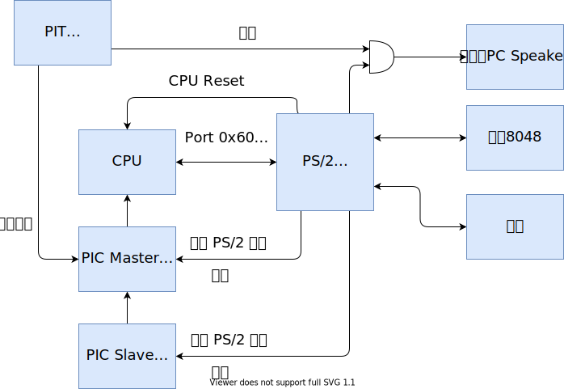
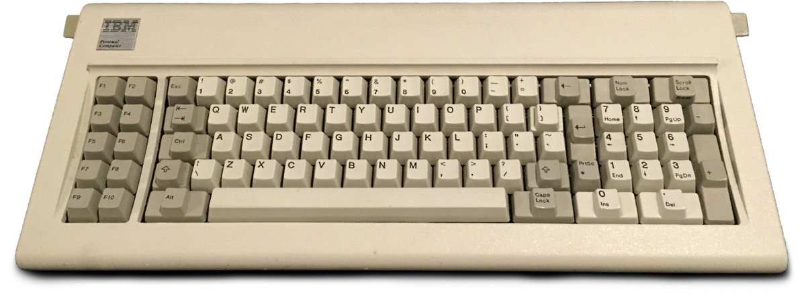
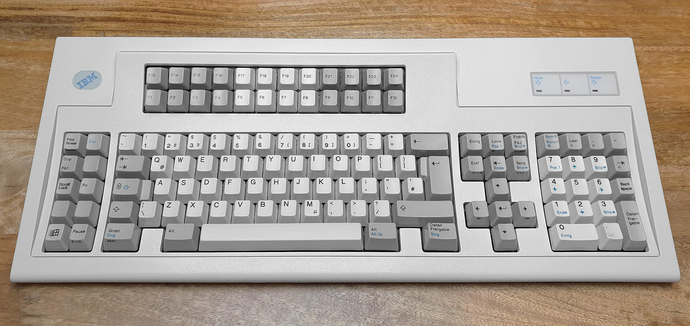

# 059 键盘驱动

本节我们实现一个 **按键回显** 的功能，即终端会回显用户按下的按键。为了实现这个功能，我们需要进一步了解负责键盘控制的硬件部件，在本项目中，我们采用的是 PS/2 键盘控制器。



PS/2 键盘控制器是一个独立的设备，早期内部通常是 Intel 8042 或兼容芯片，现在是高级集成外设 (Advanced Integrated Peripheral) 的一部分。名字可能有些误导，因为 8042 除了键盘控制器以外，还有很多其他的功能，比如：

- 系统重置（即上图中的 CPU Reset）
- A20 线控制器

## 1. 键盘扫描码

键盘扫描码是按键对应的编码方式，根据不同的编码方案，键盘扫描码有三种：

- scan code 1
- scan code 2
- scan code 3

第一套扫描码是最早的键盘使用的，他就是 XT 键盘使用的扫描码，XT 键盘如下图所示：



第二套扫描码，也就是现在使用的扫描码，用在 AT 键盘上，AT 键盘如下图所示，第二套扫描码的控制器是 8048：


第三套扫描码用在 IBM PS/2 系列高端计算机所用的键盘上，还有一些商业版 UNIX 系统的计算机也用到它，不过这种键盘如今很少看到了，因此第三套扫描码也几乎很少用到，这种键盘如下图所示：



> 所以，第二套扫描码几乎是目前使用键盘的标准，因此大多数键盘向 8042 发送的扫描码都是第二套扫描码。

----

第一套键盘扫描码：


> **注意：由组合按键显示的字符是没有扫描码的，例如 'A'、'!' 这些字符。有一些按键，其位于不同位置的按钮的扫描码，可能只是原有按钮的扫描码的扩展，例如 Alt 键。**

键盘扫描码分为：

- 通码：按下按键产生的扫描码
- 断码：抬起按键产生的扫描码

## 2. 扫描码转换

最初的 IBM-PC 键盘使用 XT 键盘，使用第一套键盘扫描码，新的 AT 键盘使用第二套扫描码，这种变化产生了兼容性的问题，不同的键盘会产生不同的扫描码，为了避免这种兼容性的问题，键盘控制器支持转换模式，如果控制器转换有效，就会将第二套扫描码转换成第一套扫描码；无论扫描码转换是否有效，都无法利用软件来得到原始的扫描码，也就是说，如果通过控制器接收到了一个字节 `0xb5`，你是无法知道原始数据是不是 `0xb5`；如果软件希望使用第二套扫描码，或者第三套扫描码，就需要禁用这种转换。

键盘默认是开启这种转换的，所以程序员只需要处理 **第一套键盘扫描码**。

## 3. 8042 控制器

| 端口 | 操作类型 | 用途       |
| ---- | -------- | -------- |
| 0x60 | 读/写    | 数据端口   |
| 0x64 | 读       | 状态寄存器 |
| 0x64 | 写       | 控制寄存器 |

**数据端口**：用于读取从 PS/2 设备或 PS/2 控制器本身接收到的数据，以及将数据写入 PS/2 设备或 PS/2 控制器本身。

**状态寄存器**：

| 比特位 | 功能 | 额外信息 |
| ----- | ---- | ------- |
| 0 | 输出缓冲区状态 | 0 表示缓冲区空，1 表示缓冲区满。只有该位被设置为 1 时，才能尝试从端口 0x60 读取数据 |
| 1 | 输入缓冲区状态 | 0 表示缓冲区空，1 表示缓冲区满。只有该位被设置为 0 时，才能尝试向端口 0x60 或 0x64 写入数据 |
| 2 | 系统标志位 | 加电时置为 0，自检通过时置为 1 |
| 3 | 命令 / 数据位 |  1 表示写入输入缓冲区的内容是命令，0 表示写入输入缓冲区的内容是数据 |
| 4 | 未知（取决于芯片）| 可能是“键盘锁定”，1 表示键盘启用，0 表示键盘禁用 |
| 5 | 未知（取决于芯片）| 可能是“发送超时”，1 表示发送超时或者输出缓冲区满 |
| 6 | 超时错误 | 0 表示没有错误，1 表示超时错误 |
| 7 | 奇偶校验错误 | 0 表示没有错误，1 表示奇偶校验出错 |

> 注意：
> ---
> - 上面所述的输出 / 输入是对于设备角度而言的，如果从 CPU 角度而言，需要将输出 / 输入对调来理解。
> 
> - 在本项目中，我们使用上述状态寄存器的第 4 位作为键盘启用 / 禁用位。

**控制寄存器**：本项目中并没有使用到，其用法请查看参考文献。

## 4. 代码分析

> 以下代码位于 `kernel/keyboard.c`

### 4.1 第一套扫描码

使用枚举来定义第一套扫描码：

```c
typedef enum key_t {
    KEY_ESC             = 0x01,
    KEY_1               = 0x02,
    KEY_2               = 0x03,
    KEY_3               = 0x04,
    ...
} key_t;
```

这里只包括了没有扩展码字节 `E0` 的扫描码，即这里的扫描码并不包括扩展码。扩展码通过后续按键定义里的状态来处理。

### 4.2 按键

> 这部分的设计可以参考 [Keyboard-internal scancodes](https://www.scs.stanford.edu/10wi-cs140/pintos/specs/kbd/scancodes-9.html) 的解释说明。

定义按键类型，包括该按键对应的字符，以及相关的状态。

```c
typedef struct ket_state_t {
    char keycap[2];     // [0] 单独按键的字符，  [1] 与 shift 组合按键的字符
    bool key_state[2];  // [0] 是否按下该扫描码，[2] 是否按下该扫描码的扩展码
} key_state_t;
```

接下来定义一个 `keymap`，用于对键盘的按键进行映射。

```c
static key_state_t keymap[] = {
    /* 扫描码 = { 单独按键的字符 | 与 shift 组合按键的字符 | 是否按下该扫描码 | 是否按下该扫描码的扩展码 } */
    [KEY_ESC]           = {{0x1b, 0x1b}, {false, false}},
    [KEY_1]             = {{'1', '!'}, {false, false}},
    [KEY_2]             = {{'2', '@'}, {false, false}},
    [KEY_3]             = {{'3', '#'}, {false, false}},
    ...
}
```

### 4.3 键盘管理器

定义一个键盘管理器 `keyboard`，用于管理键盘的状态，比如各种锁定状态。

```c
// 键盘管理器
typedef struct keyboard_t {
    bool capslock;  // 大写锁定
    bool scrlock;   // 滚动锁定
    bool numlock;   // 数字锁定
    bool extcode;   // 扩展码状态
    bool ctrl;      // Ctrl 键状态
    bool alt;       // Alt 键状态
    bool shift;     // Shift 键状态
} keyboard_t;
static keyboard_t keyboard;

// 初始化键盘管理器
void keyboard_new(keyboard_t *keyboard) {
    keyboard->capslock = false;
    keyboard->scrlock  = false;
    keyboard->numlock  = false;
    keyboard->extcode  = false;
    keyboard->ctrl     = false;
    keyboard->alt      = false;
    keyboard->shift    = false;
}
```

### 4.4 键盘中断处理 

根据以下的有限状态机来对键盘中断进行处理：


```c
void keyboard_handler(int vector) {
    // 键盘中断向量号
    assert(vector == IRQ_KEYBOARD + IRQ_MASTER_NR);

    // 向中断控制器发送中断处理完成的信号
    send_eoi(vector);

    // 从键盘的数据端口读取按键信息的扫描码
    u16 scan_code = inb(KEYBOARD_DATA_PORT);
    size_t ext_state = 0; // 按键的状态索引，默认不是扩展码

    // 如果接收的是扩展码字节，则设置扩展码状态
    if (scan_code == EXTCODE) {
        keyboard.extcode = true;
        return;
    }

    // 如果是扩展码
    if (keyboard.extcode) {
        ext_state = 1;              // 修改按键的状态索引
        scan_code |= 0xe0000;       // 修改扫描码，增加 0xe0 前缀
        keyboard.extcode = false;   // 重置扩展码状态
    }

    // 获取通码
    u16 make_code = (scan_code & 0x7f);

    // 如果通码非法
    if (make_code != KEY_PRINT_SCREEN && make_code > KEY_CLIPBOARD) {
        return;
    }

    // 获取断码状态
    bool break_code = ((scan_code & 0x0080) != 0);
    if (break_code) {
        // 如果是断码，则按键状态为抬起，并返回
        keymap[make_code].key_state[ext_state] = false;
        return;
    } else {
        // 如果是通码，则按键状态为按下
        keymap[make_code].key_state[ext_state] = true;
    }

    // 是否需要设置 LED 灯
    bool led = false;
    if (make_code == KEY_NUMLOCK) {
        keyboard.numlock = !(keyboard.numlock);
        led = true;
    } else if (make_code == KEY_CAPSLOCK) {
        keyboard.capslock = !(keyboard.capslock);
        led = true;
    } else if (make_code == KEY_SCRLOCK) {
        keyboard.scrlock = !(keyboard.scrlock);
        led = true;
    }

    // 设置 Ctrl, Alt, Shift 按键状态
    // 右 Ctrl / Alt 键的扫描码是 左 Ctrl / Alt 键的扩展码，左右 Shift 键的扫描码不同
    keyboard.ctrl  = keymap[KEY_CTRL_L].key_state[0]  || keymap[KEY_CTRL_L].key_state[1];
    keyboard.alt   = keymap[KEY_ALT_L].key_state[0]   || keymap[KEY_ALT_L].key_state[1];
    keyboard.shift = keymap[KEY_SHIFT_L].key_state[0] || keymap[KEY_SHIFT_R].key_state[0];

    // 计算 Shift 状态
    bool shift = false;
    if (keyboard.capslock && isAlpha(keymap[make_code].keycap[0])) {
        // Capslock 锁定只对字母按键有效，对于数字按键无效
        shift = !shift;
    }
    if (keyboard.shift) {
        shift = !shift;
    }

    // 获取按键对应的 ASCII 码
    char ch;
    // [/?] 这个键比较特殊，只有这个键的扩展码和普通码一样，会显示字符。其它键的扩展码都是不可见字符，比如 KEY_PAD-1
    if (ext_state && (make_code != KEY_SLASH)) {
        ch = keymap[make_code].keycap[ext_state];
    } else {
        ch = keymap[make_code].keycap[shift];
    }

    // 如果是不可见字符，则直接返回
    if (ch == INV) return;

    // 否则的话，就打印按键组合对应的字符
    LOGK("press key %c\n", ch);

    return;
}
```

---

其中使用到的一些辅助宏定义如下：

```c
/* kernel/keyboard.c */

#define INV 0           // 不可见字符
#define EXTCODE 0xe0    // 扩展码字节

---------------------------------------------------------------------

/* include/xos/stdlib.h */

// 判断所给字符是否是字母（包括大小写）
#define isAlpha(c) (((c) >= 'a') && ((c) <= 'z') || (((c) >= 'A') && ((c) <= 'Z')))
```

---

其中需要注意的是，键盘管理器中，`capslock`，`numlock`，`scrlock` 按键是切换键，即按下表示进行状态的切换。而 `shift`，`ctrl`，`alt` 并不是切换键，即按下，或者抬起这个动作就表示进行状态的切换。

而在具体实现中，键盘管理器中的 `capslock`，`numlock`，`scrlock` 成员只有在按下按键时才会切换状态（抬起按键时，即是断码时会直接返回）。而键盘管理器中的 `shift`，`ctrl`，`alt` 成员则是通过查询 `keymap` 中的对应按键的状态来实现，这样在按键按下 / 抬起时，都会切换状态。

### 4.5 初始化键盘中断

在键盘中断初始化中，增加初始化键盘管理器的逻辑：

```c
void keyboard_init() {
    // 初始化键盘管理器
    keyboard_new(&keyboard);

    set_interrupt_handler(IRQ_KEYBOARD, keyboard_handler);
    set_interrupt_mask(IRQ_KEYBOARD, true);
}
```

## 5. 功能测试

测试框架与上一节相同：

```c
/* kernel/main.c */

void kernel_init() {
    console_init();
    gdt_init();
    memory_init();
    kernel_map_init();
    interrupt_init();
    clock_init();
    keyboard_init();
    task_init();
    syscall_init();

    irq_enable(); // 打开外中断响应

    hang();
    return;
}
```

启动系统后，操作键盘，会有按键回显的效果：

```bash
press key a
press key B
press key C
press key d
press key 1
press key @
...
``` 

## 6. 参考文献

- <https://www.scs.stanford.edu/10wi-cs140/pintos/specs/kbd/scancodes-9.html>
- <https://www.win.tue.nl/~aeb/linux/kbd/scancodes-1.html>
- <https://wiki.osdev.org/PS/2_Keyboard>
- <https://wiki.osdev.org/PS/2>
- <https://wiki.osdev.org/%228042%22_PS/2_Controller>
- [郑刚 / 操作系统真象还原 / 人民邮电出版社 / 2016](https://book.douban.com/subject/26745156/)
- <https://www.ceibo.com/eng/datasheets/Intel-8048-8049-8050-plcc-dip.pdf>
- <http://www.mcamafia.de/pdf/pdfref.htm>
- <http://www.mcamafia.de/pdf/ibm_hitrc07.pdf>
- <https://en.wikipedia.org/wiki/Scancode>