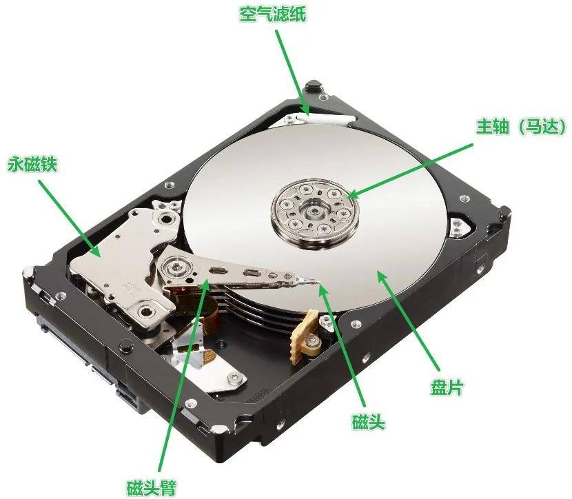

# 080 磁盘调度电梯算法 (SCAN)

由于磁盘性能的主要瓶颈在磁盘的寻道时间，也就是磁头臂的移动时间，所以要尽可能避免磁头臂的移动。电梯算法的作用是让磁头的综合移动距离最小，从而改善磁盘访问时间。




Wikipedia: Elevator algorithm

> When a new request arrives while the drive is idle, the initial arm/head movement will be in the direction of the cylinder where the data is stored, either in or out. As additional requests arrive, requests are serviced only in the current direction of arm movement until the arm reaches the edge of the disk. When this happens, the direction of the arm reverses, and the requests that were remaining in the opposite direction are serviced, and so on.


## 1. LBA 和 CHS

- LBA (Logical Block Addressing)：逻辑块寻址，逻辑上认为磁盘的扇区编号从 0 开始依次递增，处理起来更方便
- Sector: 扇区，磁盘最小的单位，多个扇区够称一个磁道
- Head: 磁头，用于读写盘面，一个磁盘可能有多个磁头，一个磁道读写完成，就换另一个磁头
- Cylinder：柱面，或者也可以认为是磁道 (Track)，同一个位置的所有磁道共同构成了柱面；当所有磁道都读写完时，就需要切换磁道，也就产生了寻道的问题。因此柱面是磁盘读写最大的单位

下面是 LBA 和 CHS 的转换公式：

- CYL = LBA / (HPC * SPT)

- HEAD = (LBA % (HPC * SPT)) / SPT

- SECT = (LBA % (HPC * SPT)) % SPT + 1

- LBA = ( ( CYL * HPC + HEAD ) * SPT ) + SECT - 1

其中：

- CYL 表示柱面 (Cylinder)
- HEAD 表示磁头 (Head)
- SECT 表示扇区 (Sector)
- LBA 表示逻辑块地址 (Logical Block Addressing)
- HPC 表示柱面磁头数 (Head Per Cylinder)
- SPT 表示磁道扇区数 (Sector Per Track)

根据 LBA 与 CHS 的转换公式，以及磁道 (track) 从外侧计数，所以可以观察到，LBA 越小则越靠近外侧，LBA 越大则越靠近内测。这样我们在实作时就可以直接使用 LBA 来调度磁盘请求，而无需转化成 CHS。

## 2. 代码分析

### 2.1 寻道方向

根据电梯调度算法描述，定义一下磁盘的寻道方向，然后在设备中加入寻道方向字段 `direction`，并在初始化设备时将寻道方向设置为向内侧寻道 `DIRECT_IN`（因为 C 盘位于外侧，寻道速度最快，所以磁头一开始是位于外侧的，设置向内侧寻道也合理）。但是需要注意的是这个字段只有磁盘/分区设备才使用，但是为了兼容性，我们将它加在虚拟设备类型中，这也体现出 C 语言在面向对象情境下表达能力不强的缺陷，如果使用 Rust 实现会更加优雅。

```c
//--> include/xos/device.h

// 磁头寻道方向
typedef enum dev_direction_t {
    DIRECT_IN,  // 向内寻道
    DIRECT_OUT, // 向外寻道
} dev_direction_t;

// 虚拟设备
typedef struct dev_t {
    ...
    dev_direction_t direction;  // 磁盘寻道方向
    ...
} dev_t;


//--> kernel/device.c

// 初始化虚拟设备
void device_init() {
    for (size_t i = 0; i < DEV_NR; i++) {
        ...
        dev->direction = DIRECT_IN;
    }
}
```

### 2.2 电梯调度算法 (SCAN)

在请求列表 `request_list` 中使用 `list_insert_sort()` 对磁盘请求按照起始的 LBA 进行排序，`head` -> `tail` 是向内侧寻道，`tail` -> `head` 则是向外侧寻道。我们根据的是请求的起始 LBA 大小进行排序，即对于分散的扇区请求才使用 SCAN 算法，对于连续的扇区读写无需使用磁盘调度算法（因为此时磁盘 I/O 效率已经最佳）。

```c
//--> kernel/device.c

// 块设备请求
void dev_request(devid_t dev_id, void *buf, size_t count, size_t idx, i32 flags, req_type_t type) {
    ...
    
    // 将请求加入对应设备的请求列表，如果设备的请求列表有其它请求，则阻塞等待调度
    // 否则直接执行请求，无需阻塞
    // 使用插入排序算法，按照 LBA 的大小进行排序
    bool flag = list_empty(&dev->request_list);
    // list_push_back(&dev->request_list, &req->node);
    list_insert_sort(&dev->request_list, &req->node, list_node_offset(request_t, node, idx));
    
    ...

    // 执行对应的请求操作，并移出请求列表
    do_dev_request(req);
    request_t *next_req = next_request(dev, req);
    list_remove(&req->node);
    kfree(req);

    // 电梯调度算法 (SCAN)
    if (next_req != NULL) {
        assert(next_req->task->magic == XOS_MAGIC); // 检测栈溢出
        task_unblock(next_req->task);
    }
}
```

这里使用了一个函数 `next_request()` 来取下一个请求，这个是磁盘电梯调度算法的核心，需要实现以下效果：

> disk head move from one end to the other end

所以需要在请求列表这个链表上实现 `from one end to the other end`，因为是双向循环链表，并且之前提到 `head` -> `tail` 是向内侧寻道，`tail` -> `head` 则是向外侧寻道，所以实作也比较直观。

1. 根据当前以及请求列表来判断是否到达寻道的一端，如果到达了寻道的一端，则改变寻道方向。
2. 根据寻道方向获取下一个请求。
3. 如果没有其它请求，则返回 NULL。

```c
//--> kernel/device.c

// 使用电梯调度算法 (SCAN) 获取所给磁盘请求 req 的下一个请求
static request_t *next_request(dev_t *dev, request_t *req) {
    list_t *list = &dev->request_list;

    // 如果磁盘在当前寻道方向上没有待处理的请求，则变换寻道方向
    // 磁盘设备请求列表按照请求的 LBA 进行排序，即正向为向内寻道，反向为外里寻道
    if (dev->direction == DIRECT_OUT && list_istail(list, &req->node)) {
        dev->direction = DIRECT_IN;
    } else if (dev->direction ==  DIRECT_IN && list_ishead(list, &req->node)) {
        dev->direction = DIRECT_OUT;
    }

    // 根据寻道方向获取下一个请求
    list_node_t *next = NULL;
    switch (dev->direction) {
    case DIRECT_OUT:
        next = req->node.next;
        break;
    case DIRECT_IN:
        next = req->node.prev;
        break;
    default:
        panic("Unknown device direction...\n");
        break;
    }

    // 如果没有其它请求则返回 NULL
    if (list_singular(list)) {
        return NULL;
    }

    return element_entry(request_t, node, next);
}
```

2.3 日志信息

为了后续测试的直观，在块设备发出请求 `dev_request()` 和 块设备执行请求 `do_dev_request()` 中加入打印日志信息的逻辑：

```c
//--> kernel/device.c

// 块设备请求
void dev_request(devid_t dev_id, void *buf, size_t count, size_t idx, i32 flags, req_type_t type) {
    LOGK("Device %d request index %d\n", req->dev_id, req->idx);
    ...
}

// 块设备执行请求
static void do_dev_request(request_t *req) {
    LOGK("Device %d do request index %d\n", req->dev_id, req->idx);
    ...
}
```

## 3. 功能测试

测试与上一节类似，但是上一节我们是使用 `pid` 来发出请求的扇区 LBA，这样会使用连续的请求是 2, 3, 4，都是同一寻道方向的。但是为了测试电梯调度算法，需要依次发出不同寻道方向的请求，这样才能观察到电梯调度算法是否按预期执行。所以我们使用 `uid` 字段来指示请求。

```c
//--> kernel/task.c

// 初始化任务管理
void task_init() {
    ...
    task_create((target_t)test_thread, "test", 5, 1);
    task_create((target_t)test_thread, "test", 5, 5);
    task_create((target_t)test_thread, "test", 5, 3);
}


//--> kernel/syscall.c

// 系统调用 test 的处理函数
static u32 sys_test() {
    ...
    u32 uid = current_task()->uid;
    memset(buf, uid, 512);
    dev_request(device->dev_id, buf, 1, uid, 0, REQ_WRITE);
    ...
}
```

1，5，3 显然不是同一寻方向的请求，所以使用电梯调度算法的预期为请求的执行顺序为：1, 3, 5

进行调试并观察输出的日志信息，与块设备请求相关的日志信息顺序预期如下：

```bash
Device 3 request index 1
Device 3 request index 5
Device 3 request index 3
Device 3 do request index 1
Device 3 do request index 3
Device 3 do request index 5
```

顺序无需严格遵循上面，但是三条 device request 和三条 device do request 的内部顺序必须满足。


## 4. 参考文献

1. [赵炯 / Linux内核完全注释 / 机械工业出版社 / 2005](https://book.douban.com/subject/1231236/)
2. <https://en.wikipedia.org/wiki/Elevator_algorithm>
3. [周志遠教授作業系統CH12＿Operating System Chap12 Mass Storage System.pdf](https://ocw.nthu.edu.tw/ocw/upload/141/news/%E5%91%A8%E5%BF%97%E9%81%A0%E6%95%99%E6%8E%88%E4%BD%9C%E6%A5%AD%E7%B3%BB%E7%B5%B1_chap12%EF%BC%BFOperating%20System%20Chap12%20Mass%20Storage%20System%20%EF%BC%BF.pdf)